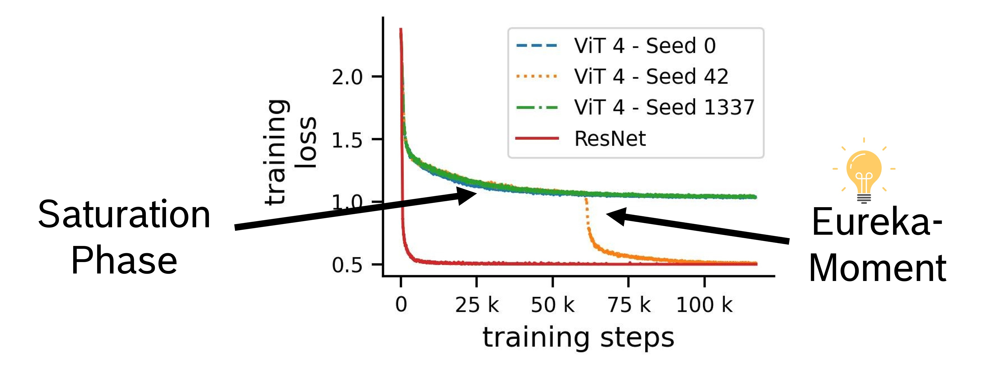

# Eureka-Moments in Transformers: <br> Multi-Step Tasks Reveal Softmax Induced Optimization Problems

This is the code accompanying our ICML 2024 paper [Eureka-Moments in Transformers: Multi-Step Tasks Reveal Softmax Induced Optimization Problems](https://arxiv.org/abs/2310.12956).



# Installation
We recommend using anaconda to set up the environment. Run 
```
conda create -n eureka python=3.9
conda activate eureka

conda install pytorch==1.12.1 torchvision==0.13.1 -c pytorch
conda install matplotlib
conda install conda-forge::tensorboard
conda install tensorboardx
conda install conda-forge::python-dateutil
pip install timm==0.4.12
pip install "Pillow<10.0.0"

```
to create and activate your conda environment. 

Download FashionMnist and MNIST and place them in the data folder

# Using the code
### To train a vanilla ViT on our main dataset use
```
python main.py --lr=5e-4 --min-lr=1e-6 --mnist_task spacial_decision_indicator_digit_1_2_fashion --data-set MNIST_spacial_decision --output_dir <your_out_path> 
```

### To train a ViT with NormSoftmax on our main dataset use
```
python main.py --lr=1e-5 --min-lr=1e-6 --mnist_task spacial_decision_indicator_digit_1_2_fashion --data-set MNIST_spacial_decision --attention_type=norm_softmax --output_dir <your_out_path> 
```

### To train a ViT with HT on our main dataset use
```
python main.py --lr=1e-4 --min-lr=1e-6 --mnist_task spacial_decision_indicator_digit_1_2_fashion --data-set MNIST_spacial_decision --temperature_annealing=True --start_temperature=3.0 --end_temperature=0.125 --temperature_schedule='half_cosine' --output_dir <your_out_path> 
```

### To log gradients and attention maps use also
```
--return_attention=True --qkv_grad_plot=True --log_attention=True --log_abs_gradient=True
```

# Citation

If this code is useful in your research we would kindly ask you to cite our paper.

```
@InProceedings{hoffmann_eureka,
  title =     {Eureka-Moments in Transformers: Multi-Step Tasks Reveal Softmax Induced Optimization Problems},
  author =    {Hoffmann, David T. and Schrodi, Simon and Bratulić, Jelena and Behrmann, Nadine and Fischer, Volker and Brox, Thomas},
  booktitle = {International Conference on Machine Learning},
  year =      {2024},
  month =     {July}
}
```

# License
eureka-moments is open sourced under the [AGPL-3.0](LICENSE).
For a list of other open source components included in eurekaMoments, see the file [3rd-party-licenses.txt](3rd-party-licenses.txt).


## Purpose of the project
This software is a research prototype, solely developed for and published as
part of the publication cited above. It will neither be
maintained nor monitored in any way.

## Contact
Please feel free to open an issue or contact us personally if you have questions, need help, or need explanations.

hoffmann@cs.uni-freiburg.de
